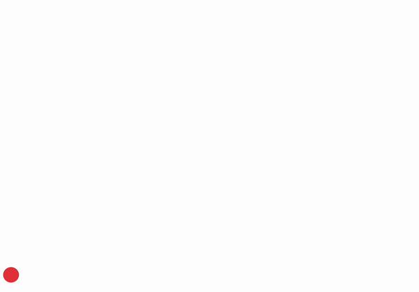

# Curve Fitting using Least Square, Total Least Square and RANSAC

## Files: 
	Ball_travel_10fps.mp4 : input video without noise
	Ball_travel_2_updated.mp4: input video with noise
	curveFitting.py - main file to run for Problem2 - curve fitting
	homography.py - file to run for Problem2
	myUtils.py - helper file

## How to run
	python3 curveFitting.py --vid Ball_travel_10fps.mp4
	python3 curveFitting.py --vid Ball_travel_2_updated.mp4

## Problem 1 - Without Noise

### Least Square method

### Total Least Square method

### RANSAC

## Problem 2 - With Noise

### Least Square method

### Total Least Square method

### RANSAC

